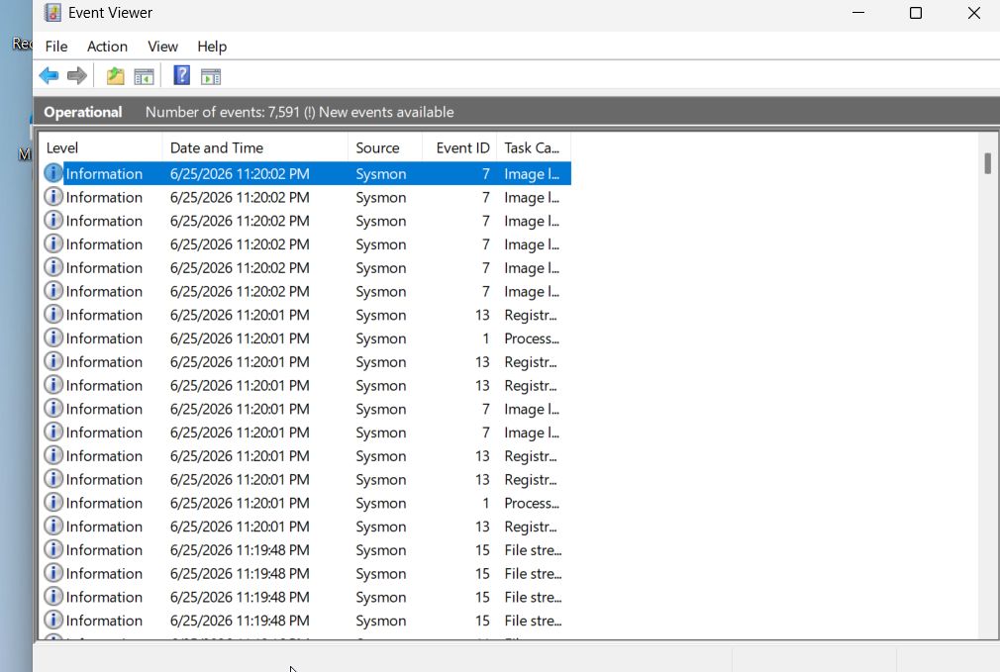

# Credential Access Detection using Sigma Rules
OBJECTIVE:

Detect credential dumping activities such as:

1)Mimikatz execution

2)LSASS memory access

3)Credential dumping attempts

4)suspicious process creation

ARCHITECTURE:

Windows VM
     |

Sysmon Logs
     |
     
Windows Event Logs
     |
     
Sigma Rules
     |
     
Detection Results

Sysmon Event Logs

Sysmon was successfully installed and configured on the Windows endpoint.

